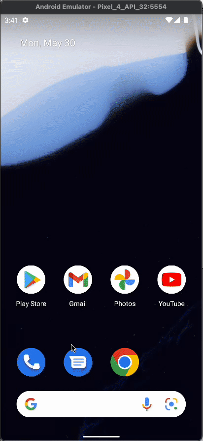

## React native animações

E você pode estar se perguntando: “para que eu devo utilizar animações?”, “quais são as vantagens?”, “que tipos de animações eu vou aprender?”.

Saiba que as animações são uma excelente forma de interação com o usuário, tanto para indicar uma determinada ação que ele deve fazer em nosso aplicativo, quanto, também, fornecer um feedback caso algo esteja carregando.

Mas o que vamos fazer especificamente nesse curso? Esse é o Med, ele é o aplicativo de consultas médicas que vamos utilizar como projeto nesse curso. A ideia é aplicar diversas animações em determinadas áreas, determinadas telas e componentes desse aplicativo.

Uma das animações que vamos fazer é o Carrossel. Perceba que algumas imagens estão sendo exibidas na tela principal automaticamente e em loop, então isso já dá uma animação para o nosso aplicativo e o deixa muito mais vivo que um aplicativo estático.

Outra animação que vamos fazer é uma suavização na transição entre uma tela ou uma determinada informação que vai ser exibida. Perceba que ao clicar no botão “Começar” vão aparecer alguns inputs, só que eles não vão aparecer instantaneamente, eles vão aparecer de forma linear, de uma forma mais suave.

Vou clicar no botão “Começar”. Perceba que os inputs apareceram e não foram instantâneos. Isso dá uma experiência para o usuário muito mais agradável de se usar esse aplicativo.

Ao clicar no botão “Entrar”, perceba que temos um efeito de carregamento um pouco diferente. Esse efeito de carregamento, nós vamos ver que ele fornece para o usuário uma sensação muito melhor do que um carregamento simples de loading. Vamos entender porque ele é utilizado em empresas como o Facebook, Netflix, YouTube e até o mais famoso, que é o Instagram.

Ao lado temos a tela de exibição das consultas médicas. Temos os cards dos pacientes, e ao clicar em algum card de paciente, vamos para a tela de “Detalhes”, onde vamos aplicar mais uma animação, no botão de “Notificar consulta”. Perceba que nós temos um sino no botão, e ao clicar no botão esse sino sofre uma animação de balanço e depois ele é preenchido.

E uma outra animação que vamos ver ao longo desse curso é a primeira coisa que é exibida quando entramos no aplicativo, que é a chamada Splash Screen. Vamos entender o que é Splash Screen, mas perceba que, ao carregar a nossa aplicação – vou dar um reload nela – vai ser exibida a logo do AluraMed, só que ela vai aparecer com uma animação.

Veja que a logo apareceu e, logo em seguida, apareceu a tela de onboarding, que é a tela de exibição de informação. Só que as imagens e textos não apareceram instantaneamente, elas tiveram uma suavização e depois se estabilizaram.

Então é isso. Vamos ver algumas animações, vamos aprender a utilizar diversas bibliotecas para aplicar outras animações também. Espero que você tenha ficado curioso e saiba também que essas animações deixam o nosso aplicativo com uma sofisticação e uma experiência para o usuário bem melhor do que o aplicativo simples e sem animação.


<!-- https://alura-github-thumbnail-generator.vercel.app/ -->

<h4 align="center"> 
	Med
</h4>

<p align="center">
  <a href="#information_source-o-que-é-o-aluramed">O que é o AluraMed?</a>&nbsp;&nbsp;&nbsp;|&nbsp;&nbsp;&nbsp;
  <a href="#rocket-Tecnologias">Tecnologias</a>&nbsp;&nbsp;&nbsp;|&nbsp;&nbsp;&nbsp;
  <a href="#information_source-como-usar">Como usar</a>&nbsp;&nbsp;&nbsp;|&nbsp;&nbsp;&nbsp;
</p>

## :information_source: O que é o Med?

O Med é uma aplicação feita em React Native que simula um aplicativo de consultas médicas. A ideia é usar animações nesse projeto para tornar a aplicação mais agradável e intuitiva.

Esse projeto é utilizado na formação base de React Native da plataforma da empresa Med.


<h1 align="center">
    
</h1>


## :rocket: Tecnologias

Esse projeto foi desenvolvido com a utilização das seguintes tecnologias:
- [React Native][rn]
- [Expo][expo]

## :information_source: Como usar

Para copiar e executar essa aplicação, você precisa de três pré-requisitos: [Git](https://git-scm.com), [Node.js][nodejs] + [Yarn][yarn] intalados no seu computador.

No terminal, digite os comandos a seguir:

### Baixar e instalar o projeto

```bash
# Clonar esse repositório
$ git clone https://github.com/alura-cursos/react-native-animacoes.git

# Vá para o ropositório
$ cd AluraMed

# Instale as dependências
$ npm install
```

### Executar o Mobile

```bash
# Execute em outro terminal (dentro da pasta Med)
$ expo start
```

Espero que você utilize ao máximo deste projeto para se aprimorar! E se quiser dar um salve, estou lá no LinkedIn
:wave: 

[nodejs]: https://nodejs.org/
[expo]: https://docs.expo.dev/
[rn]: https://facebook.github.io/react-native/
[yarn]: https://yarnpkg.com/
